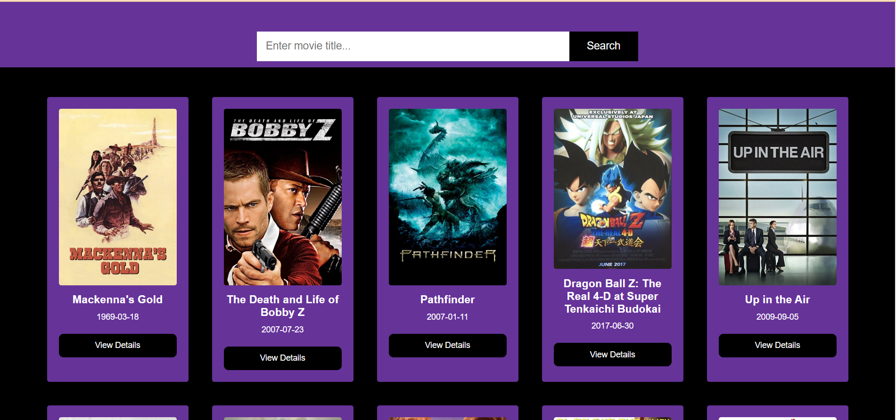
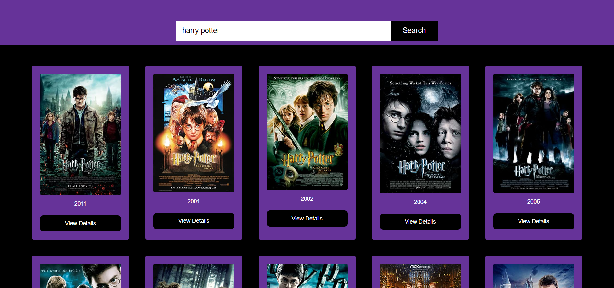
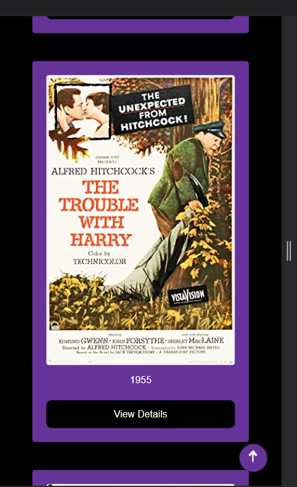

# Movie Search Web App
This is a movie search web app built using HTML, CSS, and JavaScript. The app allows users to search for movies, retrieve movie information from the OMDb API, and display the results in a visually appealing way. Additional features include generating random movie displays on each reload which gives different users different expereinces using the TMDb API, viewing movie details, error handling, responsiveness, and attractive styling.

## Live Demo
A live demo of the project can be accessed [here](https://movie-ratings-app.vercel.app/).

## Screenshots

When User Lands on the page

When User makes a search

When user clicks to view more details

Mobile User

## Cloning the Project

To clone the project to your local machine, follow these steps:
1. Ensure you have Git installed on your machine.
2. Open a terminal or command prompt.
3. Change the current working directory to the location where you want to clone the project.
4. Run the following command:
git clone `<repository-url>` with the URL of the project's Git repository.

## Usage
1. Open the project in a web browser.
2. When user lands on the page they see randomly displayed movie adverts that change on each refresh or reload.
3. Enter a movie title in the search input field.
4. Click the "Search" button.
5. The app will fetch movie data from the OMDb API and display the search results.
6. Each movie result includes the movie title, poster image, release year, and a "View Details" button.
7. Clicking the "View Details" button will display additional information about the movie, such as the plot summary, cast, and genre.
8. The app is responsive and designed to work well on different screen sizes.
9. Enjoy searching for movies and exploring the details!

## API Key
The OMDb API requires an API key to access its data. To obtain a free API key, follow these steps:
1. Visit the [OMDb API website](http://www.omdbapi.com/) and sign up for an account.
2. After signing up, you will receive an API key.
3. Open the `main.js` file in the project.
4. Locate the `apiKey` variable declaration at the top of the file.
5. Replace `'9b718451'` with your API key within the quotes.

## Bonus Features
The project includes some bonus features that you can explore:

- infinite scrolling to display multiple sections of search results.
- Incorporating movie ratings or reviews from a different API

Feel free to extend the project with these features to enhance its functionality and user experience.
